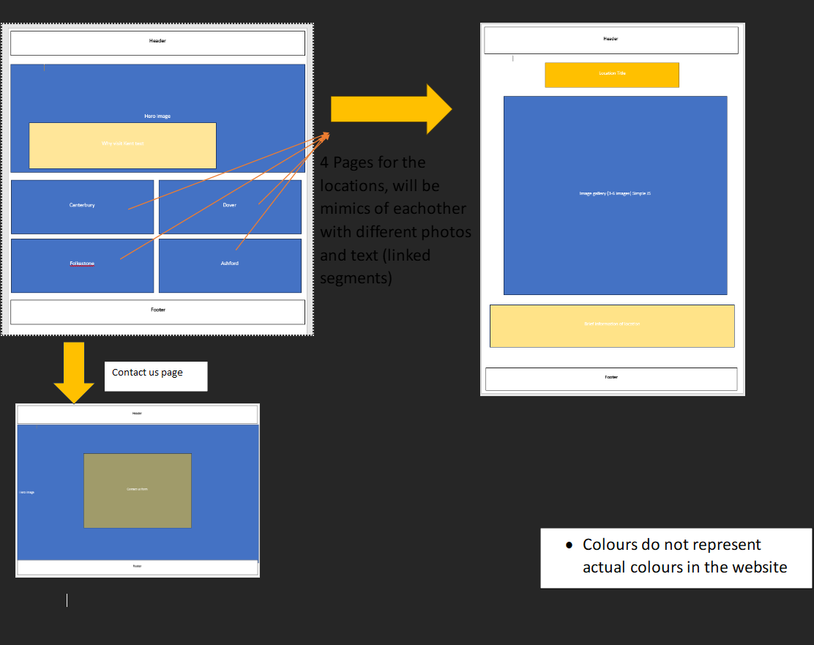

# Visit Kent
## user-centric frontend development project
---

Visit Kent is designed for people who would like to visit kent but are unsure about places to visit or what kent has avaliable.

Live Site https://tropicalbunny.github.io/MyRepo/Landing-Page

## Table of content
- [UX](#ux)
    - [User stories](#user-stories)
        - [New User Goals](#new-user-goals)
        - [Returning User Goals](#returning-user-goals)
    - [Project Goals](#project-goals)
    - [Business Goals](#business-goals)
    - [Minimum Acceptance Criteria](#minimum-acceptance-criteria)
- [Development](#development)
    - [Inital Idea](#inital-idea)
    - [Final Idea](#final-idea)
        - [Notable Design Decisions](#notable-design-decisions)
    - [Testing](#testing)
        - [Pre code Testing](#pre-code-testing)
        - [During Code Testing](#during-code-testing)
        - [Final Testing](#final-testing)
## UX

---

### User Stories

The main end user goals is to find and visit highly rated locations in kent.

#### New User Goals

- I would expect clear direction to locations and what they have to offer
- I expect to be able to contact if i have any questions, or struggle finding something that suits me
- I would like simple design responces that show me where i am.
- as a user of the website i want to be able to find highly rated activites in kent

#### Returning User Goals

* easily find other locations and information about them

### Project Goals

The main project goal of this website is to make an easy, user friendly website for all ages. to achieve this, I have broken down the goals into achievable milestones.

- Make an incredibly simple UI so people that have less knowledge to technology can have a pleasant experience
- Clearly show locations, with images that peak intrest

### Business Goals

The main business goal is to create a positive experience so consumers will frequently return.

- increase business traffic
- increase page rank and advertisement revenue

### Minimum Acceptance Criteria

- Easy access to different locations and what they have to offer
- Streamlined Experience
- User friendly across all devices

## Development

---

### Inital idea

My original idea (above) i had started coding, but while developing i decided the user interface was messy and uninspired. which pushed me to go back to the drawing board and redevelop how i wanted the website to look and function. my biggest issue was Phone users wasnt in the forefront of my mind, and while coding i realised the website would easily become cluttered and awkward to navigate, below are some brief descriptions of issues i had. (will not go into detail as re-development had its own issues)

- spacing issues with icons
- hover over changes issues
- aligning logo left without changing in nav bar
- reduction of hero image resolutions to fit. (will go into more detail below)

### Final Idea

i designed the website with simplicity in mind, trying to create a logical and reasoned flow across all pages, the physical process of the webpage is the same whether it be tablet, desktop or phone. 

above is the basic function of the website, this is how i wanted the website to flow to each webpage.

This was my re-design to make the website more user friendly, this is where i also created how i wanted the webpage to look across several devices, so i could maintain structural and user-centric stability.
the colours i have used across the site:

color: #D93D4A;
color: #A41818;
color: #4A4646;
color: #A07171;
color: #FFFFFF;

Fonts:
for titles i have used: 'Cinzel', as a backup serif
for text i have used: 'Josefin Sans', as a backup sans-serif
i have used two fonts so i could create a sense of hirearchy across the site

#### Notable Design Decisions.

i decided to move the Home link to the center of the navigation bar, this was due to the "locations" drop down list not sitting correctly under the link

I added Photos behind the location containers, i felt the site was a little bland. this made a sublte but big difference. (photo includes two with and two without)

## Testing

---

### Pre code Testing

used adobe color wheel to make sure contrast between text and background was acceptable.

### During Code Testing

Checking and updating media querys to make sure structure is not comprimised when modifying code (see images below) i used egde developer tools to help me identify and rectify any issues uncovered, this was a regular tool that i used. 

I had major issues with the Footer, the containers wouldnt align properly once they had their contents, after a re-code i managed to fix the issue

### Final Testing

Release a beta for the website, given to people with various devices to check integrity and discover bugs.

### User comments

* Capital letters on locations, and some incorrect spelling
* overall easy to navigate
* responsive design is a nice touch 
* the website worked as i expected it too

Testers were on a variety of devices,

Iphone 13
Samsung s21 ultra
Iphone 11 Pro max.
Iphone 13 pro
Iphone 12

the webpage responded and ran as expected across all the above devices.

### Personal testing

* checked each navigational link and confirmed they are working
* checked the form links and notice they do not work since being deployed.
* made sure all text and containers align as thye should.

 i have used JigSaw w3c to validate my CSS, Passed all clear.

 i have used w3c html validator to validate my HTML, i have uncovered a few issues (shown below)
and i have taken steps to fix them.

i used lighthouse to make sure my website is in working order, below is my score for desktop:
# add photo of score here.

below is my score on phone:
# add photo of score here.

i have updated my website based on the recomendations given, below is my new score on phone:
# add photo of score here.

#### Features implemented

the website consists of 8 pages, 6 are accessable from the navigation bar, while one is an about us page accessable from the footer, the other is a success page after subbmitting the contact us form.

##### Landing Page
this page neded to be the most appealing of the page, when people come to my website i want them to stay and see what i have to offer,
so i selected a hero image that would grab attention.
then below this i have my 4 chosen locations that i hyperlinked to their respective pages

##### Location Pages
these pages hold the galleries to showcase their respective locations, 4 of these pages have been made.
i kept the design simple and intresting, holding 3 images and text about the location

##### Contact us page
this page i also kept simple, i centralised the form over a background so i had little wasted space

##### About us 
Simple page using a mix of the location page and landing page. simple text showing off me.

* Slideshow gallery
* drop down list for locations
* underline links on hover
* bold and slight size increase of active navbar webpage

#### Planned Features

* Radius search
* trip-advisor search
* user reviews

### Technologies used

* HTML 5
* CSS 3
* JAVASCRIPT (through w3c schools gallery)
* bootstrap v4
* Font awesome
* Google fonts
* Github
* gitpod
* Figma for design

### Issues

#### Known bugs

#### fixed bugs

* odd blue lines hanging off fontawesome icons (solution: added Text-tranform: none)
* font awesome container offsets when set to display :inine; (rebuilt the footer fully)
* footer box 1 off center when shrinking (solved after footer rebuild)
* photos in 4k had to be reduced to 1080p for easier placement.
* nav bar wouldnt center with display: inline, used bootstrap to correct the issue.
* drop down list on locations off center, changed the layout of header to rectify.

## Deployment
### Process

Process for deploying a front end website was fairly easy. as i have all my commits and main branch on Gitpod it made the most sense to deploy on there as well, i used their deployment Gitpod Pages.

#### The Deployment of the project was as follows:

* use this link https://github.com/Tropicalbunny/MyRepo to get to my repo, login as yourself and click code
* clone a copy for yourself
* once you have a copy, head to settings on the navigation bar.
* under code and automation, click pages
* you change source to "deploy from branch" 
* the branch will be "main" and "/root" you then click save.
* the deployment process can take a few minutes, let this complete you can see the progress on the code page under Enviroments.

###  Encounted issues 

Galleries havent Deployed correctly. the images come up with error message 404 not being found. a little playing around and i found that the issue was the directories, in the preview the directories only worked a specific way, now its delpoyed i had to change them back to link

## Credits

---

### Images
* pixabay (https://pixabay.com/photos/)
* Thomas Anderson, Hanne Jessen. for some stunning photos.

### Code aid
* Adegbenga Adeye (Mentor)
* Pasquale Fasulo (COBC Tutor)
* w3c schools for the Gallery (https://www.w3schools.com/html/)
* bootstrap v4.6 (https://getbootstrap.com/docs/4.6/)

### Testing

* My Team At PML
* Family Programmers
